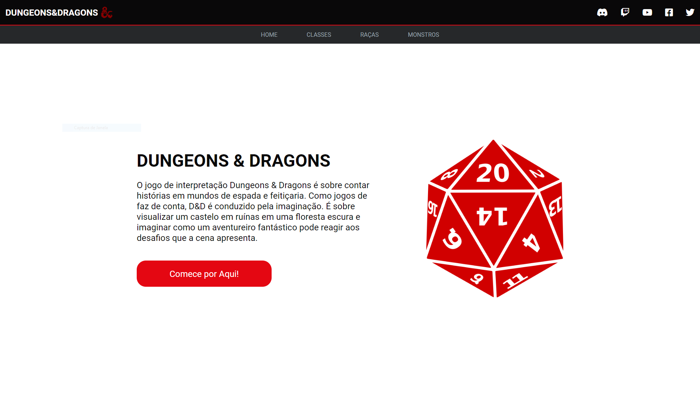
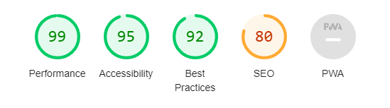

# Api Dungeons and Dragons

[Projeto](https://github.com/AlexssandroSilvaGomes/api-dungeons-and-dragons)

# Sobre

Projeto com a proposta de praticar a utilização de rotas para navegação entre as páginas do website e a criação de webcomponents. Tudo através do consumo de uma api, aplicando os conhecimentos aprendidos em sala de aula.

# Tecnologia utilizada

- HTML5
- CSS3
- JavaScript
- Markdown
- Responsividade
- API

# Autoavaliação

- [ ] `Documentou problemas, se encontrado, para futuras consultas?`
- [X]  Foi criado o layout no figma?
- [X] `A página foi construída seguindo o planejado no Figma?`
- [ ]  A página funciona em dispositivos diferentes?
- [X] `Foi consumida a API escolhida?`
- [X]  Foi criado web componentes?
- [X] `Foi criado um padrão de roteamente para as paginas?`
- [x]  As funções foram criadas seguindo à boa prática de responsabilidade única?
- [X] `Quando possível, foi criado funções puras?`
- [X] `O projeto está publicado?`
- [X]  Foi criado o arquivo README.md?

# LightHouse

# Autor

- [Alexssandro da Silva Gomes](https://github.com/AlexssandroSilvaGomes)
